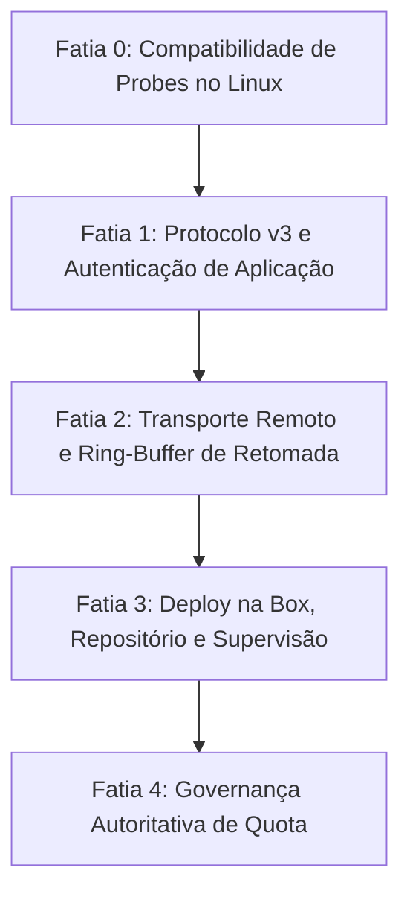

# ADR 00: Arquitetura da Separação Remota (`aihub Remote Split`)

- **Status:** **PROPOSTO / NO-GO PARA IMPLEMENTAÇÃO IMEDIATA**
- **Data:** 2026-09-17
- **Princípios base:**
  - `wiki/principles/architecture-decision-records`
  - `wiki/principles/explicit-handles-over-transport-sessions`
  - `wiki/principles/terminate-and-reissue-credentials-at-every-trust-boundary`
  - `wiki/principles/owner-approved-agent-pairing-broker`
- **Documentos de suporte:**
  - [01-transporte-e-sessao.md](01-transporte-e-sessao.md)
  - [02-fronteira-de-confianca.md](02-fronteira-de-confianca.md)
  - [03-credenciais-e-quota.md](03-credenciais-e-quota.md)
  - [04-operacao-na-box.md](04-operacao-na-box.md)

---

## Veredito

**NO-GO**: A implementação está formalmente suspensa até que o dono resolva quatro pré-condições bloqueantes:
1. **Validação jurídica dos Termos de Uso dos provedores:** A sessão 03 condicionou a execução dos harnesses no servidor Linux headless à aprovação pelo dono dos termos de serviço (Anthropic, OpenAI, Cursor, Google) para operação em nuvem/VPS com contas individuais/OAuth, sem a qual a premissa de mover a execução para a box torna-se inviável.
2. **Resolução da contradição de segurança na junta de transporte (Sessões 01 e 02):** A sessão 01 estipulou duas conexões físicas independentes no transporte remoto (Controle e PTY), enquanto a sessão 02 desenhou autenticação de aplicação assumindo que uma única conexão autenticada serve a todo o tráfego IPC. Sem um mecanismo formal de vinculação criptográfica da segunda conexão (ex.: `channel_ticket`), o canal de PTY fica vulnerável a sequestro de terminal.
3. **Inoperância do probe do Antigravity no Linux:** O código atual em [`aihub-probe/src/antigravity.rs:356-359`](../../../aihub-probe/src/antigravity.rs#L356) retorna incondicionalmente `None` fora do macOS, forçando o status `QuotaStatus::Unknown` e bloqueando o roteador de despachar tarefas para `agy` na box Linux até que um fallback seja implementado.
4. **Indefinição de capacidade da box e toolchain C para compilação:** O workspace depende de `rusqlite` com a feature `bundled` ([`Cargo.toml:53`](../../../Cargo.toml#L53)), exigindo um compilador C funcional do alvo tanto para compilação direta na box quanto para compilação cruzada. Sem a definição do ambiente da box (distro, CPU, RAM), a estratégia de entrega de binários permanece aberta.

---

## 1. Contexto e Motivação

O `aihub` foi concebido originalmente para rodar como um conjunto de processos colocalizados em um único macOS ([`docs/PLAN.md`](../../../docs/PLAN.md)):
- O cliente TUI ([`aihub`](../../../aihub/src/lib.rs)) conecta-se a [`aihubd`](../../../aihubd/src/lib.rs) exclusivamente via Unix Domain Socket local ([`aihub-core/src/paths.rs:14-21`](../../../aihub-core/src/paths.rs#L14)) protegido por permissões de arquivo (`0o600`, [`aihubd/src/lib.rs:238`](../../../aihubd/src/lib.rs#L238)).
- Se a conexão falha, o cliente tenta subir um daemon local via `Command` ([`aihub/src/connection.rs:12-36`](../../../aihub/src/connection.rs#L12)).
- Ao fechar o laptop Mac ou perder conectividade, o laço de reconexão síncrono trava a interface por 5 segundos e encerra a aplicação ([`aihub/src/lib.rs:304-334`](../../../aihub/src/lib.rs#L304)).

A evolução arquitetural ("Remote Split") tem como objetivo apartar o daemon para uma box Linux remota do dono. O Mac passa a atuar como um visor TUI destacável que conecta e desconecta livremente, sem interromper o trabalho de IA em execução.

---

## 2. Decisão Arquitetural Sintetizada

Caso as decisões do dono sejam respondidas favoravelmente, a arquitetura alvo consolida os quatro desenhos nas seguintes diretrizes:

### 2.1 Topologia e Posicionamento (Sustentado por 03 e 04)
- **Desenho 1 ("Tudo na Box"):** O daemon `aihubd`, os processos supervisionados de harnesses PTY, o repositório git canônico e as worktrees temporárias residem integralmente na box Linux ([`03-credenciais-e-quota.md` §2](03-credenciais-e-quota.md)).
- **Cliente como Apresentação:** O binário `aihub` no Mac atua puramente como visualizador Ratatui, encaminhando teclas e redimensionamento e exibindo streams de terminal e telemetria recebidos via rede.
- **Rede e Exposição:** O daemon escuta exclusivamente em loopback (`127.0.0.1:<porta>`, [`04-operacao-na-box.md` §5](04-operacao-na-box.md)), sendo exposto para o cliente externo exclusivamente através de um túnel nomeado seguro.

### 2.2 Transporte e Retomada de Sessão (Sustentado por 01)
- **Dois Canais Lógicos Desacoplados:** Separação entre Canal de Controle (RPC leve em JSON) e Canal de PTY (Streaming binário de entrada e saída, sem o overhead de Base64 de [`aihub-core/src/ipc.rs:18-81`](../../../aihub-core/src/ipc.rs#L18)), prevenindo que bursts de terminal bloqueiem comandos de controle ([`01-transporte-e-sessao.md` §2.1](01-transporte-e-sessao.md)).
- **Retomada por Offset e Ring-Buffer de 2 MiB:** Cada byte de PTY recebe um `stream_offset: u64` monotônico. O daemon retém até 2 MiB por sessão em RAM. Reconexões enviam `Attach { last_seen_offset }`:
  - Se o offset estiver no buffer, envia apenas o delta sem piscar a tela.
  - Se o buffer estourar (`gap_detected: true`), o cliente executa reset do VT e recebe o snapshot completo ([`01-transporte-e-sessao.md` §2.2, §3](01-transporte-e-sessao.md)).
- **Liveness Não-Destrutivo:** Heartbeats a cada 5 segundos no canal de controle. Timeout de 15s desconecta o cliente de transporte sem emitir sinais para o processo filho ou alterar o estado da sessão ([`01-transporte-e-sessao.md` §2.4](01-transporte-e-sessao.md)).
- **Handles Seguros:** `SessionId` gerado por CSPRNG de 128 bits e estritamente amarrado à identidade autenticada (`session.owner = principal_id`), vetando acesso a clientes não autorizados ([`01-transporte-e-sessao.md` §4](01-transporte-e-sessao.md)).

### 2.3 Fronteira de Confiança e Autenticação (Sustentado por 02)
- **Identidade e Pareamento:** Chave assimétrica gerada localmente no Mac com prova de posse de desafio criptográfico no handshake. Admissão autorizada via login do dono em seu IdP existente (sem broker como serviço de rede intermediário) ([`02-fronteira-de-confianca.md` §1, §33, §51-57](02-fronteira-de-confianca.md)).
- **Verificação Positiva de Audiência:** O daemon valida explicitamente se a credencial tem audiência destinada a si (`audience = "aihubd"`), rejeitando tokens de outros serviços do dono ([`02-fronteira-de-confianca.md` §2](02-fronteira-de-confianca.md)).
- **Autorização em Três Níveis:**
  1. *Leitura:* `ListSessions`, `RequestQuota`.
  2. *Operação de Sessão:* `NewSession`, `Attach`, `Detach`, `PtyInput`, `PtyResize`, `RouteRequest`, `SetMode`, `SubmitTask`, `SwitchHarness`.
  3. *Destrutiva:* `MergeRequest` (exige envelope assinado independente com nonce de uso único na confirmação) ([`02-fronteira-de-confianca.md` §4](02-fronteira-de-confianca.md)).
- **Regra de Não-Encaminhamento de Credenciais:** Nenhuma credencial de harness armazenada na box vaza para mensagens `DaemonMessage` ([`02-fronteira-de-confianca.md` §8](02-fronteira-de-confianca.md)).
- **Falha Fechada:** Mensagem de erro opaca uniforme (`unauthorized`) para qualquer falha de autenticação/autorização, registrando detalhes apenas em log de auditoria interno ([`02-fronteira-de-confianca.md` §6](02-fronteira-de-confianca.md)).

### 2.4 Credenciais e Governança de Quota (Sustentado por 03)
- **Autoridade Canônica na Box:** O `aihubd` na box é a autoridade única da quota; ele executa os probes e faz push periódico via `DaemonMessage::QuotaPush` ([`03-credenciais-e-quota.md` §5](03-credenciais-e-quota.md)). O cliente Mac nunca publica quota.
- **Supressão de Transcrições em Falha de Probe:** Para prevenir corridas silenciosas de concorrência com o desktop na mesma conta, a box desativa roteamento otimista por transcrições em disco quando probes de fornecedores falharem, reportando `QuotaStatus::Unknown` ([`03-credenciais-e-quota.md` §4](03-credenciais-e-quota.md)).
- **Desacoplamento do `ai-memory`:** O serviço é tratado como opcional via `AI_MEMORY_SERVER_URL`. Se ausente, o daemon acumula handoffs no spool local `handoffs.jsonl` sem travar trocas de harness ([`03-credenciais-e-quota.md` §8](03-credenciais-e-quota.md)).

### 2.5 Operação e Supervisão Linux (Sustentado por 04)
- **Estrutura de Diretórios:** Binário em `~/.local/bin/aihubd`, dados/socket em `~/.local/share/aihub`, logs em `~/.local/share/aihub/log/aihubd.log`, e worktrees em `/tmp/aihub/worktrees` ([`04-operacao-na-box.md` §3](04-operacao-na-box.md)).
- **Supervisão:** Baseline pragmático com script de lançamento e `nohup` (com rotação de log obrigatória), com trilha documentada para migração a supervisor de user-space (`runit` ou `supervisord`) quando necessário ([`04-operacao-na-box.md` §3, §4](04-operacao-na-box.md)).
- **Repositório Canônico:** O repositório git principal fica permanentemente clonado na box. A entrega de alterações para o GitHub ocorre preferencialmente via push acionado pelo Mac (após fetch da branch mesclada) ou deploy key de escopo restrito na box ([`04-operacao-na-box.md` §6](04-operacao-na-box.md)).

---

## 3. Mapa de Contradições e Trade-offs

| Contradição | Posição A | Posição B | Custo das Opções | Recomendação do Sintetizador |
|---|---|---|---|---|
| **1. Segurança de Canal Duplo vs. Conexão Única** | **Sessão 01:** Duas conexões físicas separadas (Controle e PTY) para evitar Head-of-Line blocking. | **Sessão 02:** Handshake autentica uma vez por conexão e assume que todo o IPC corre sobre ela. | **A (Duplo handshake):** Duplo custo de crypto a cada reconexão. **B (Channel Ticket):** Conexão primária gera ticket efêmero assinado para o PTY. **C (QUIC):** Multiplexa streams na mesma conexão, mas sofre bloqueio UDP em middleboxes. | **Opção B:** Se mantido WebSocket/TCP, a conexão de PTY deve apresentar obrigatoriamente um `channel_ticket` de uso único emitido pela conexão de controle autenticada. |
| **2. Local dos Harnesses vs. Termos de Uso** | **Sessão 03 / 04:** Executar tudo na box Linux headless para manter supervisão PTY e persistência. | **Sessão 03 (aberta):** Termos de uso de contas pessoais podem vetar servidores remotos. | **A (Tudo na box):** Risco contratual com fornecedores de IA. **B (Harness no Mac):** Destrói persistência ao fechar laptop e exige RPC remoto de filesystem/worktrees. | **Opção A condicionada:** Recomendar "Tudo na box", porém mantendo o projeto em **NO-GO** até aval formal do dono. |
| **3. Ciclo de Vida de Sessões Órfãs em Crash** | **Sessão 01:** Retenção de 24h da sessão com ring-buffer de 2 MiB em RAM. | **Sessão 04:** Processos sob `setsid` sobrevivem ao crash do daemon e ficam órfãos inalcançáveis. | **A (Manual):** `pkill` manual no script de boot; perde sessões vivas. **B (Persistência em disco):** Daemon grava PIDs e estado em disco para reatrelamento ou encerramento gracioso no arranque. | **Opção B:** O daemon deve persistir um catálogo mínimo (`sessions.json`) em disco para auditar e limpar ou reanexar PIDs órfãos ao reiniciar. |
| **4. Credencial de Git Push** | **Sessão 04:** Sugere que o broker de 02 emita credencial temporária de push. | **Sessão 02:** Rejeitou categoricamente a existência de um broker de rede separado. | **A (Deploy key na box):** Segredo de longa duração na box. **B (Push via Mac):** Mac faz fetch da branch na box e dá push no GitHub com sua credencial. **C (SSH agent forward):** Encaminhamento de credencial pelo IPC. | **Opção B na fase 1**, evoluindo para **Opção A** (chave restrita de deploy) para automação completa. |
| **5. Instalação do `ai-memory`** | **Sessão 03:** Sugere manter apenas spooling local permanente em `handoffs.jsonl` sem o serviço. | **Sessão 04:** Propõe implantar o binário `ai-memory` como serviço sob `nohup` na box. | **A (Subir serviço):** Mais um processo sem supervisão nativa. **B (Apenas spool):** Zero overhead operacional na box, acumulando registros para sincronização futura. | **Opção B como default:** `ai-memory` roda via spool em disco; se a variável `AI_MEMORY_SERVER_URL` for apontada para um servidor real, ele drena. |

---

## 4. Lacunas de Junta Identificadas

1. **Observabilidade e Diagnóstico Remoto:**
   - O daemon não possui canal de telemetria de integridade da infraestrutura (uso de RAM, espaço livre em `/tmp`, status de conectividade do túnel).
   - Se o daemon rejeitar a autenticação, ele responde erro genérico `unauthorized` ([`02-fronteira-de-confianca.md` §6](02-fronteira-de-confianca.md)). O cliente no Mac não tem visibilidade para saber se a rejeição decorre de relógio desincronizado (skew de timestamp), chave não aprovada ou certificado expirado.
   - *Ação necessária:* Criar um comando local de diagnóstico `aihub doctor --remote` capaz de inspecionar o status do pareamento e da rota de rede.
2. **Diagnóstico da TUI em Conexão Perdida:**
   - O banner de reconexão proposto em [`01-transporte-e-sessao.md` §2.5](01-transporte-e-sessao.md) não distingue entre falha de DNS, túnel fora do ar, recusa de handshake TLS ou timeout de resposta do daemon.
   - *Ação necessária:* A máquina de estados da TUI deve capturar o erro retornado pela camada de transporte e exibi-lo no banner (`Falha de rota DNS`, `Túnel recusou conexão`, `Daemon ocupado`).
3. **Atualização de Versão e Preservação de PTYs:**
   - Se o daemon `aihubd` for reiniciado para atualização de versão enquanto sessões estão em andamento:
     - O ring-buffer de 2 MiB em memória de 01 é perdido.
     - Os master file descriptors do PTY são fechados pelo kernel, o que emite `SIGHUP` ou `EIO` para os harnesses filhos.
   - *Ação necessária:* Documentar formalmente que a atualização do daemon é uma operação destrutiva para sessões ativas na fase 1, planejando para fases posteriores suporte a socket handover ou supervisores com descritores herdados (`systemd-style fd passing`).
4. **Armazenamento Volátil de Worktrees em `/tmp` na Box:**
   - [`aihub-core/src/paths.rs:25-26`](../../../aihub-core/src/paths.rs#L25) coloca worktrees em `/tmp/aihub/worktrees`. Em distribuições Linux e contêineres, `/tmp` é comumente um `tmpfs` limitado na memória RAM.
   - *Ação necessária:* Mudar o default de worktree root em Linux para `~/.local/share/aihub/worktrees`, evitando esgotar a RAM do host durante compilações volumosas de código.
5. **Bootstrapping do Primeiro Pareamento:**
   - Falta detalhar o fluxo interativo do primeiro contato entre Mac e box: a TUI abre o navegador? Exibe uma URL de pareamento no terminal?
   - *Ação necessária:* Especificar que, na ausência de credencial válida, o comando `aihub --daemon <URL>` exibe um código curto de emparelhamento e URL para aprovação via IdP no Mac.

---

## 5. Auditoria de Citações dos Documentos Anteriores

Amostragem e checagem estrita de afirmações centrais contra o código-fonte em `MathBorgess/ai-hub`:
- **[`01-transporte-e-sessao.md`](01-transporte-e-sessao.md):**
  - Citações de `connect_or_start_daemon` ([`aihub/src/connection.rs:12-36`](../../../aihub/src/connection.rs#L12)), codec de 32 MiB ([`aihub-core/src/codec.rs:7`](../../../aihub-core/src/codec.rs#L7)), handshake estrito de versão 2 ([`aihub-core/src/ipc.rs:12`](../../../aihub-core/src/ipc.rs#L12), [`aihub/src/connection.rs:168-204`](../../../aihub/src/connection.rs#L168), [`aihubd/src/lib.rs:951-973`](../../../aihubd/src/lib.rs#L951)) e laço bloqueante de reconexão ([`aihub/src/lib.rs:304-334`](../../../aihub/src/lib.rs#L304)) foram **confirmadas com precisão exata**.
- **[`02-fronteira-de-confianca.md`](02-fronteira-de-confianca.md):**
  - Confirmação de que não existe auditoria durável no daemon (apenas `log_lifecycle` em stderr efêmero, [`aihubd/src/lib.rs:36-89`](../../../aihubd/src/lib.rs#L36), e spool de handoff em `:616`).
  - Permissões de bind `0o700`/`0o600` e accept loop sem autenticação ([`aihubd/src/lib.rs:166-254, 833`](../../../aihubd/src/lib.rs#L166)): **confirmadas com precisão exata**.
- **[`03-credenciais-e-quota.md`](03-credenciais-e-quota.md):**
  - Bloqueios `cfg(target_os = "macos")` em `read_keychain_claude_credentials` ([`aihub-probe/src/claude.rs:190`](../../../aihub-probe/src/claude.rs#L190)), `read_antigravity_session` ([`aihub-probe/src/antigravity.rs:350`](../../../aihub-probe/src/antigravity.rs#L350)), e supervisão com `libc::kill(-pgid)` ([`aihub-pty/src/spawn.rs:67-104`](../../../aihub-pty/src/spawn.rs#L67)): **confirmadas com precisão exata**.
- **[`04-operacao-na-box.md`](04-operacao-na-box.md):**
  - *Erro menor de citação encontrado:* O documento citou `rusqlite` bundled em `Cargo.toml:57` e `profile.release` em `:64`. A verificação aponta que `rusqlite` bundled está em [`Cargo.toml:53`](../../../Cargo.toml#L53) e `lto = "thin"` em [`Cargo.toml:62`](../../../Cargo.toml#L62) (deslocamento de 4 linhas). O conteúdo técnico da dependência de C foi confirmado.
  - Ausência de `git push` em [`aihub-git/src/lib.rs`](../../../aihub-git/src/lib.rs): **confirmada**.

---

## 6. Caminho de Migração em Fatias

O plano de migração é dividido em 5 fatias verticais incrementais. **Em todas as fatias, a execução local por Unix Domain Socket permanece 100% funcional, mantendo retrocompatibilidade estrita.**

### Fatia 0: Compatibilidade dos Probes em Linux Headless
- **O que entrega:**
  - Implementação de fallback não-macOS para leitura de credenciais do Antigravity em [`aihub-probe/src/antigravity.rs`](../../../aihub-probe/src/antigravity.rs) (via `~/.config/antigravity/` ou variável `GEMINI_AUTH_TOKEN`).
  - Fallback explícito de leitura de arquivos JSON para o Cursor (`~/.config/cursor/auth.json`) sem depender de `state.vscdb`.
  - Configuração do pipeline de CI (`.github/workflows/ci.yml`) para rodar `cargo test` em target Linux (`x86_64-unknown-linux-gnu`).
- **O que passa a ser testável:**
  - Testes unitários do `aihub-probe` executam e passam em agentes Linux.
  - Roteamento de tarefas via `aihub-router` consegue selecionar `HarnessId::Antigravity` e `HarnessId::Cursor` em Linux.
- **O que ainda não funciona:**
  - Nenhuma conectividade remota; o daemon continua operando localmente no host de execução.

### Fatia 1: Handshake v3 e Autenticação de Aplicação
- **O que entrega:**
  - Extensão aditiva de `ClientMessage::Hello` ([`aihub-core/src/ipc.rs:88`](../../../aihub-core/src/ipc.rs#L88)) com suporte a versão negociada (`version = 3`) e payload de credencial opcional ([`01-transporte-e-sessao.md` §2.8](01-transporte-e-sessao.md)).
  - Módulo de verificação criptográfica no daemon validando prova de posse de chave pública e checagem de audiência (`audience = "aihubd"`).
  - Regra de aceitação incondicional de clientes v2/sem credencial em listeners Unix socket locais; rejeição obrigatória em listeners de rede.
  - Geração de `SessionId` seguro via CSPRNG de 128 bits amarrado ao `principal_id` do cliente ([`01-transporte-e-sessao.md` §4](01-transporte-e-sessao.md)).
- **O que passa a ser testável:**
  - Conexões locais continuam funcionando sem credenciais.
  - Conexões TCP em loopback rejeitam chamadores sem prova de posse com código genérico `unauthorized`.
  - Tentativas de anexar a sessões de outro principal são rejeitadas.
- **O que ainda não funciona:**
  - O transporte ainda não possui ring-buffer nem desconexão resiliente com delta catch-up.

### Fatia 2: Transporte Remoto e Ring-Buffer de Retomada com Canal Duplo
- **O que entrega:**
  - Implementação do transporte remoto WebSocket sobre TLS (`tokio-tungstenite`) com suporte a `--daemon <URL>` na CLI ([`aihub/src/cli.rs`](../../../aihub/src/cli.rs)).
  - Separação entre Canal de Controle (RPC JSON) e Canal de PTY (streaming binário).
  - Emissão de `channel_ticket` na conexão primária para autenticar o canal PTY secundário, sanando a contradição 01/02.
  - Ring-buffer sequenciado por offset monotônico (`stream_offset: u64`) com teto de 2 MiB por sessão no daemon ([`01-transporte-e-sessao.md` §2.2](01-transporte-e-sessao.md)).
  - Máquina de reconexão assíncrona com exponential backoff e banner visual não-bloqueante na TUI ([`aihub/src/lib.rs`](../../../aihub/src/lib.rs)).
- **O que passa a ser testável:**
  - Quedas transitórias de rede reatam transparentemente com delta de bytes.
  - Desconexões longas que excedem 2 MiB ativam `gap_detected` e executam reset limpo de tela.
  - Encerramento do cliente não emite sinal para o processo filho do harness.
- **O que ainda não funciona:**
  - O daemon ainda está sendo executado manualmente para testes; scripts de instalação na box Linux e automação de túnel ainda não existem.

### Fatia 3: Instalação na Box Linux, Repositório Canônico e Supervisão
- **O que entrega:**
  - Script de instalação Linux (`scripts/install-linux.sh`) idempotente com layout `~/.local/bin/aihubd` e supervisão baseline `nohup` + script de lançamento ([`04-operacao-na-box.md` §3, §8](04-operacao-na-box.md)).
  - Configuração de bind em `127.0.0.1:<porta>` e integração com túnel nomeado para a box.
  - Estabelecimento do clone canônico do repositório git na box e worktree root em disco não-volátil (`~/.local/share/aihub/worktrees`).
  - Fluxo de merge local com suporte a `git fetch` e push coordenado.
- **O que passa a ser testável:**
  - O usuário no Mac abre a TUI, conecta via túnel ao `aihubd` na box, inicia sessão, fecha a tampa do laptop, reabre e encontra a sessão ativa executando.
- **O que ainda não funciona:**
  - Governança refinada de concorrência de quota multi-host com o Mac desktop.

### Fatia 4: Governança Autoritativa de Quota e Endurecimento Operacional
- **O que entrega:**
  - Política pessimista de quota: supressão de estimativa por transcrições em falha de probe na box ([`03-credenciais-e-quota.md` §4](03-credenciais-e-quota.md)).
  - Rotação de logs com `logrotate` na box e sanitização de `PtyOutput` para segredos.
  - Persistência de manifesto de sessões ativas em disco (`sessions.json`) para reconciliação de processos órfãos em caso de reinício do host.
- **O que passa a ser testável:**
  - Robustez a concorrência de uso entre navegador/CLI no Mac e aihub na box.
  - Daemon sobrevive a restarts limpando e reportando adequadamente processos legados.

---

## 7. Consequências da Decisão

### O que melhora
- **Resiliência Absoluta:** Tarefas de IA de longa duração não são mais interrompidas quando o Mac dorme, troca de Wi-Fi ou é reiniciado.
- **Economia de Recursos Locais:** Carga de CPU, memória de build e tráfego de git concentram-se na box Linux.
- **Segurança de Acesso Remoto:** Conexão remota não autenticada é impossível; cada chamada de terminal é estritamente vinculada a chaves aprovadas pelo dono.
- **Economia de Banda:** Stream de PTY binário economiza 33% de bytes frente ao Base64 sobre JSON legado.

### O que piora
- **Superfície Operacional:** A box Linux passa a guardar credenciais de IA e o repositório, exigindo endurecimento e manutenção de rotação de logs.
- **Complexidade de Depuração:** Diagnóstico de falhas de conexão remota exige rastreamento em dois hosts (Mac e box) e na rota do túnel.
- **Custo de RAM no Daemon:** O daemon aloca 2 MiB fixos por sessão para o ring-buffer de retomada (~12 MiB para 6 sessões).
- **Setup Inicial:** Configuração inicial de login headless nos harnesses exige etapa assistida via terminal na box.

---

## 8. Decisões em Aberto Submetidas ao Dono

1. **Aprovação Jurídica dos Termos de Uso:** Confirmar conformidade para execução de Claude Code, Codex CLI, Cursor Agent e Antigravity CLI em servidor Linux headless.
2. **Topologia Física de Rede e Transporte:** Homologar a Saída B da Contradição 1 (WebSocket TLS com `channel_ticket` para o canal PTY secundário) ou direcionar para QUIC (`quinn`).
3. **Especificações da Box:** Fornecer capacidade de CPU, memória RAM, espaço em disco e arquitetura/distro da box para fechar a estratégia de compilação (compilação nativa na box vs. `cross` com Docker).
4. **IdP e Mecanismo de Pareamento:** Indicar qual provedor de identidade existente hospedará a aprovação dos novos clientes Mac para emissão de credenciais curtas.
5. **Credencial de Git Push:** Escolher entre (A) deploy key permanente com restrição de repositório na box ou (B) fluxo de push exclusivo a partir do Mac após fetch.
